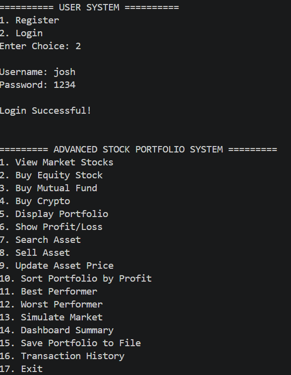
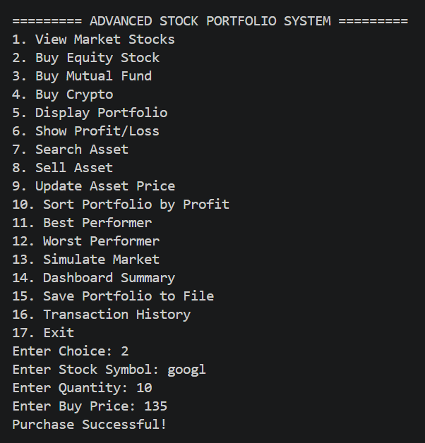
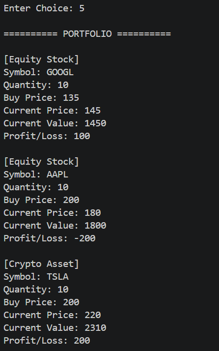
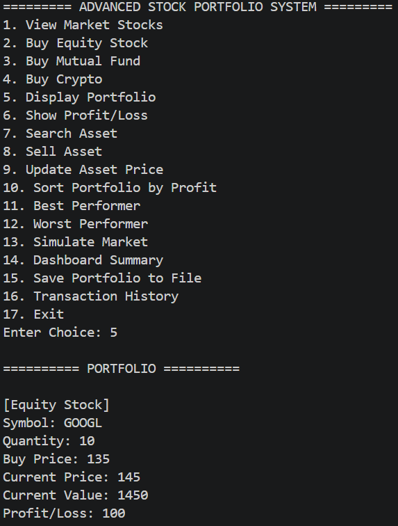
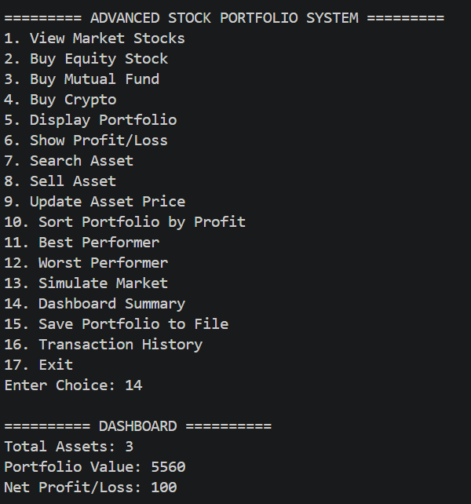
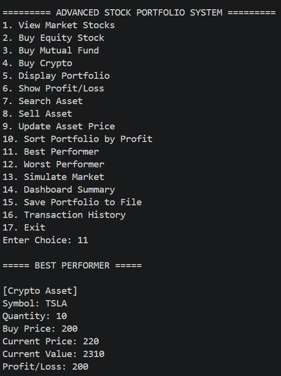
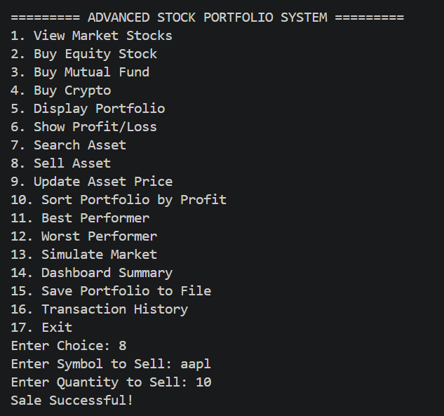
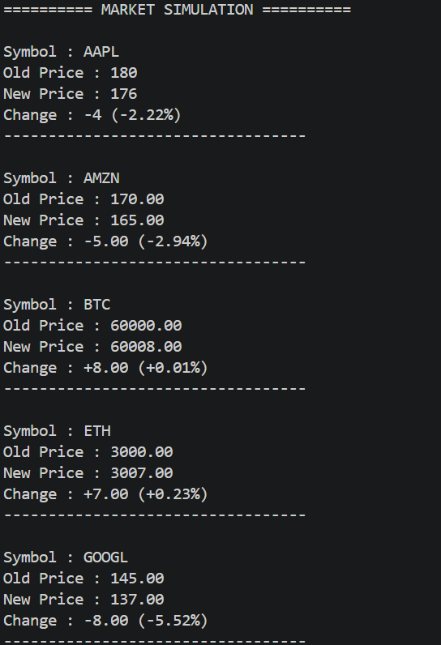
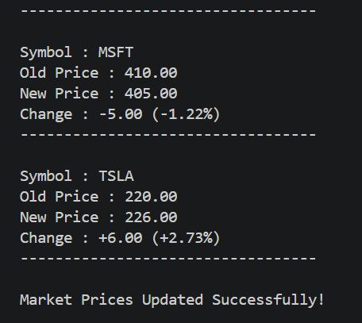
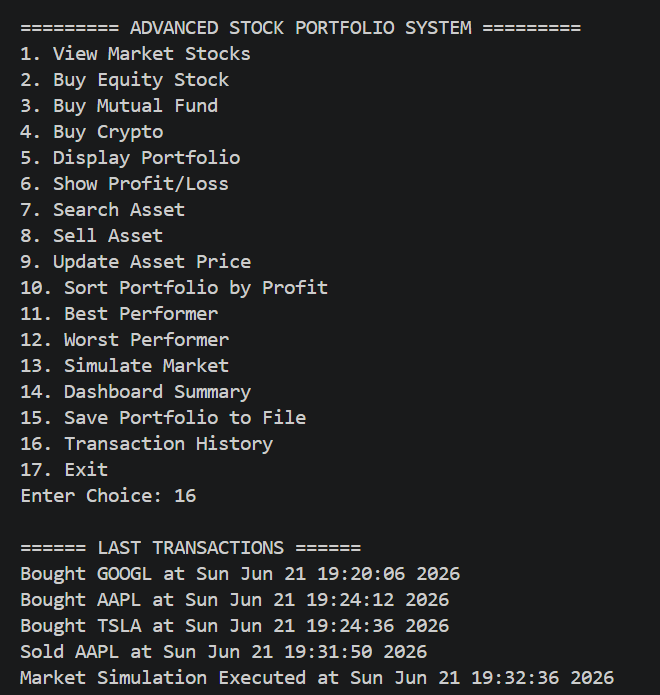

# Advanced Stock Portfolio Management System

A console-based Stock Portfolio Management application developed in **C++** using **Object-Oriented Programming (OOP)** concepts. The system allows users to manage investments, track portfolio performance, simulate market changes, and analyze profits/losses through an interactive menu-driven interface.

---

## Features

### User Management
- User Registration
- User Login Authentication
- Multiple User Support using File Handling

### Asset Management
- Buy Equity Stocks
- Buy Mutual Funds
- Buy Cryptocurrency Assets
- Sell Assets
- Search Assets
- Update Asset Prices

### Portfolio Analytics
- Display Portfolio
- Profit/Loss Calculation
- Dashboard Summary
- Best Performer Analysis
- Worst Performer Analysis
- Sort Portfolio by Profit

### Market Simulation
- View Available Market Stocks
- Simulate Real-Time Market Changes
- Automatic Asset Price Updates

### Data Persistence
- Save Portfolio to File
- Transaction History Tracking
- User Data Storage

---

## Main Menu

The application provides the following options:

1. View Market Stocks
2. Buy Equity Stock
3. Buy Mutual Fund
4. Buy Crypto
5. Display Portfolio
6. Show Profit/Loss
7. Search Asset
8. Sell Asset
9. Update Asset Price
10. Sort Portfolio by Profit
11. Best Performer
12. Worst Performer
13. Simulate Market
14. Dashboard Summary
15. Save Portfolio to File
16. Transaction History
17. Exit

---

## Technologies Used

- C++
- Object-Oriented Programming (OOP)
- STL (Vector, Map, Algorithm)
- File Handling
- Inheritance
- Polymorphism
- Abstraction
- Dynamic Memory Allocation

---

## OOP Concepts Implemented

### Encapsulation
Data members and functions are grouped into classes.

### Inheritance
`EquityStock`, `MutualFund`, and `Crypto` inherit from the base `Asset` class.

### Polymorphism
Virtual functions are used to calculate asset values and profit/loss dynamically.

### Abstraction
The abstract `Asset` class provides a common interface for all asset types.

---

## Screenshots

### Login System

### Buy Stock

### Display Portfolio

### Profit / Loss Analysis

### Dashboard Summary

### Best Performer

### Sell Asset

### Market Simulation - Example 1

### Market Simulation - Example 2

### Transaction History

---

## Sample Market Assets

| Symbol | Asset Type |
|----------|-----------|
| AAPL | Stock |
| TSLA | Stock |
| GOOGL | Stock |
| AMZN | Stock |
| MSFT | Stock |
| BTC | Cryptocurrency |
| ETH | Cryptocurrency |

---

## Future Enhancements

- Real-Time Stock Market API Integration
- Portfolio Performance Graphs
- Password Encryption
- Database Integration
- GUI Version using Qt
- Web-Based Dashboard

---

## Author

**Joshitha Gajjala**

B.Tech CSE (IoT) Student  
Shiv Nadar University
